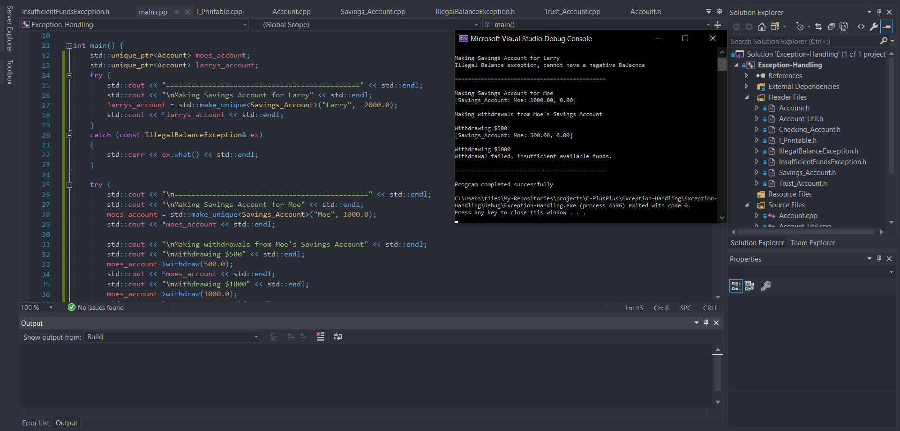

  

# Banking With Exception Handling
Building upon my previous banking apps, adding custom exception handling.

Simple Banking App -- https://github.com/tiiedye/Simple-Bank-App

Polymorphic Banking App -- https://github.com/tiiedye/Polymorphic-Bank-App

### Instructions
For this challenge we want to integrate our own user-defined exception classes into the Account class
hierarchy.

The account classes are provided for you.
Also, the IllegalBalanceException.h file contains the declaration for the IllegalBalanceException class.

What I would like you to do is:
1. Derive IllegalBalanceException from std::exception and implement the what() method to provide an exception message.
   This exception object should be thrown from the Account class constructor if an account object is created with a negative 
   balance.
   
2. Derive InsufficentFundsException from std::exception and implement the what() method to provide an exception message.
   This exception object should be thrown if a withdraw results in a negative balance.
   You should throw this exception object from the Account withdraw method.
   
That's it - good luck!
Test your code in the main driver.

Have fun and experiment!